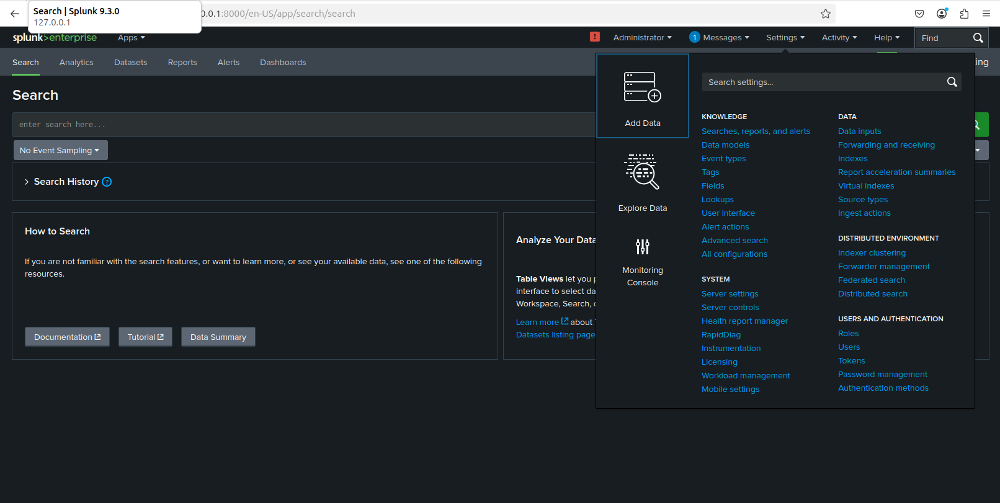
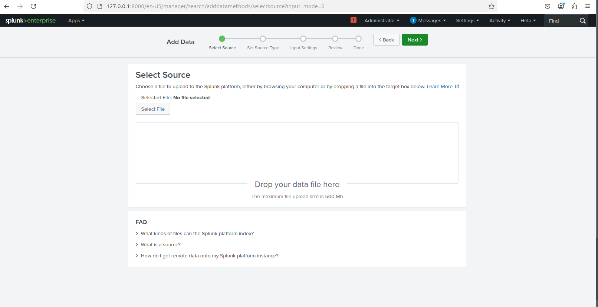
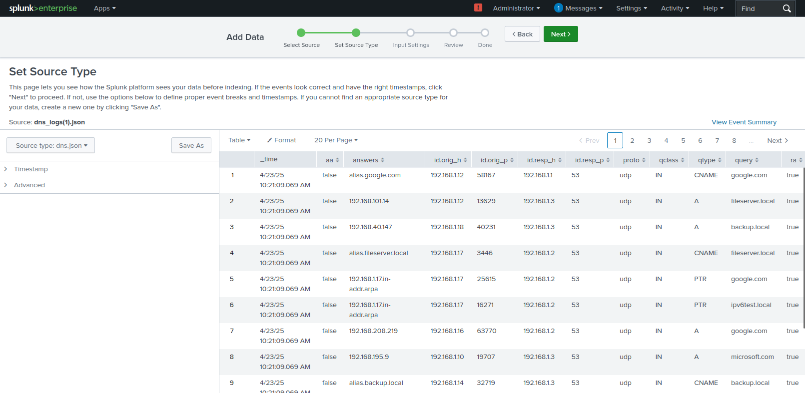
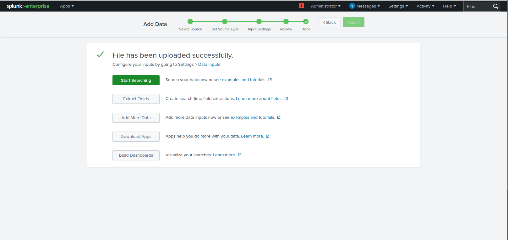
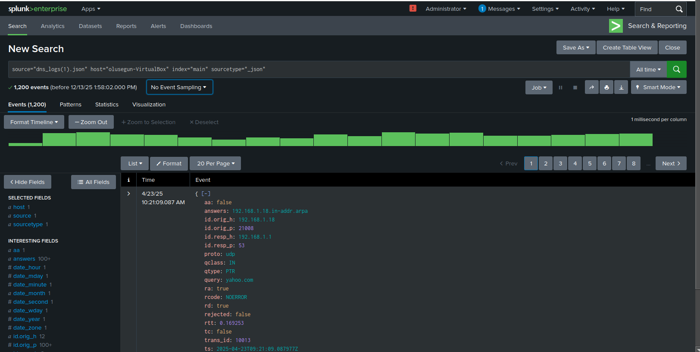

# 🧪 Lab Title: Summary of my First Task – DNS Log Analysis

---

## 🎯 Objective

In this lab, you will:
- Learn how to ingest and analyze DNS logs in Splunk.
- Understand how to extract useful information such as DNS query types, source hosts, and common destinations.
- Practice building basic SPL (Search Processing Language) queries to investigate DNS activity.

---

## 🖥️ Lab Setup

- ✅ **Splunk**: Already installed and accessible.
- ✅ **Data Source**: JSON-formatted Zeek DNS logs.
- 🌐 **Log File**: Download the file below and place it in a directory accessible to Splunk for ingestion.

📥 **[Download sample dns log file](https://github.com/samfajobi/splunk-SIEM-Log-Monitoring-Lab/blob/main/dns_logs.json)**

---

## ⚙️ Steps to Upload DNS Log into Splunk

1. Go to Splunk Web → **Settings > Add Data**.

 

2. Choose **Upload** and select the file `dns.log`.


3. Set Source type: `json` or create a custom source type `dns`.

4. Index: Choose `main` or create a new index like `dns_lab`.


5. Finish the upload and confirm indexing.


6. Now, let's start Searching!!!!.




---

## 🔍 Lab Tasks

Use SPL queries to answer the following:

### ✅Task 1: Identify the most frequently queried domain names
```spl
index=dns_lab sourcetype="json"
| stats count by query
| sort -count
```


### ✅Task 2: Find the most active user IPs generating DNS traffic
```spl
index=dns_lab sourcetype="json"
| stats count by "id.orig_h"
| sort -count
```


### ✅Task 3: Breakdown of DNS query types (A, AAAA, CNAME, PTR)
```spl
index=dns_lab sourcetype="json"
| stats count by qtype
```
