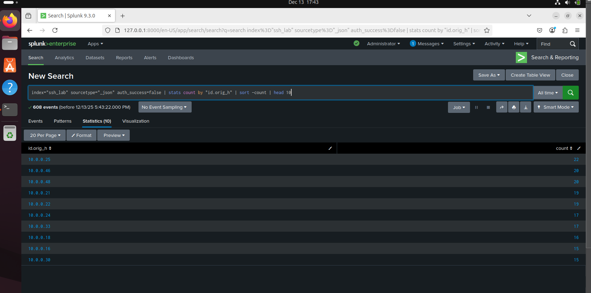
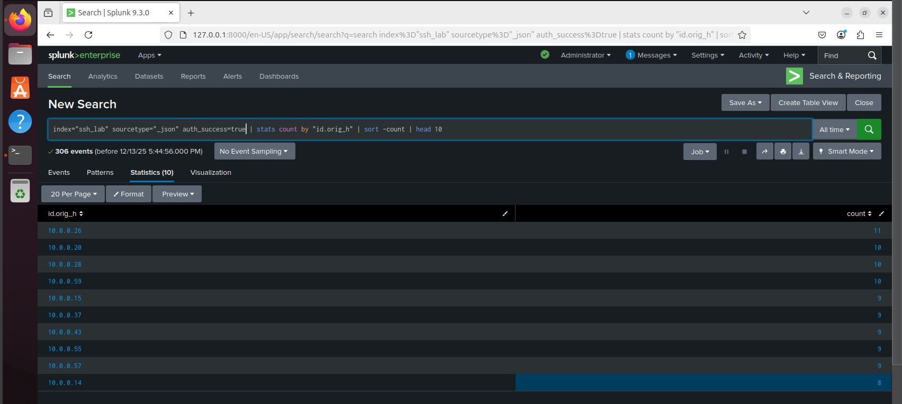

# Day#18: Snippet from my second task – SSH Log Analysis

---

## 🎯 Objective

In this lab, you will:
- Learn how to ingest and analyze SSH logs using Splunk.
- Detect failed and successful SSH authentication attempts.
- Identify unusual SSH activity that may indicate brute force or unauthorized access.

---

## 🖥️ Lab Setup

- ✅ **Splunk**: Already installed and accessible.
- ✅ **Data Source**: JSON-formatted Zeek-style SSH logs.
- 🌐 **Log File**: Download and upload to Splunk using the steps below.

📥 **[Download SSH Log file](https://github.com/samfajobi/splunk-SIEM-Log-Monitoring-Lab/blob/main/ssh_logs.json)**

---

## ⚙️ Steps to Upload SSH Log into Splunk

1. Go to Splunk Web → **Settings > Add Data**.
2. Choose **Upload** and select `synthetic_zeek_ssh.json`.
3. Set Source type: `json` or create a new one `zeek:ssh`.
4. Index: Choose `main` or create a new index like `ssh_lab`.
5. Finish the upload and confirm indexing.

---

## 🔍 Lab Tasks

Use SPL queries to complete the following analysis:

### ✅Task 1: List the top 10 endpoints with failed SSH login attempts
```spl
index=ssh_lab sourcetype="json" auth_success=false
| stats count by "id.orig_h"
| sort -count
| head 10
```
 

### ✅Task 2: List the top 10 endpoints with successful SSH login attempts
```spl
index=ssh_lab sourcetype="json" auth_success=false
| stats count by "id.orig_h"
| sort -count
| head 10
```
 

### ✅Task 3: Find the number of total SSH connections
```spl
index=ssh_lab sourcetype="json"
| stats count as total_ssh_connections
```
### ✅Task 4: Count all event types (successful, failed, no-auth, multiple-failed) seen in the logs
```spl
index=ssh_lab sourcetype="json"
| stats count by event_type
```