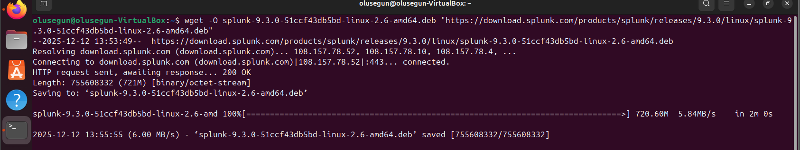
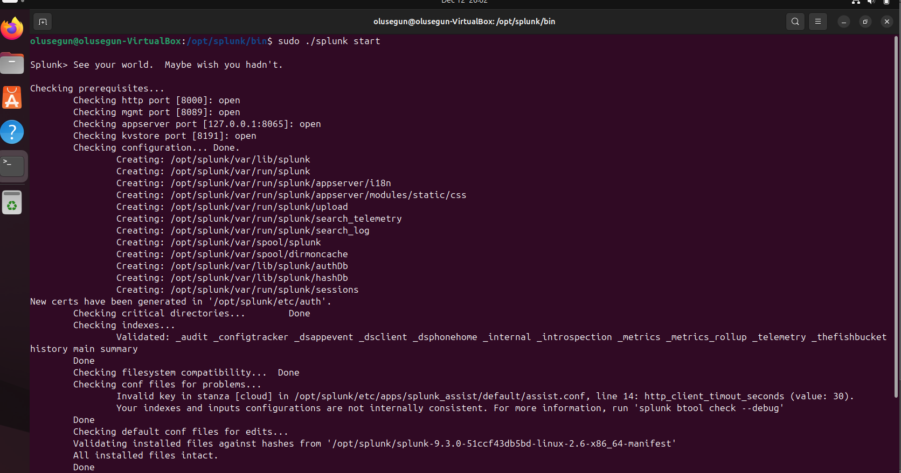
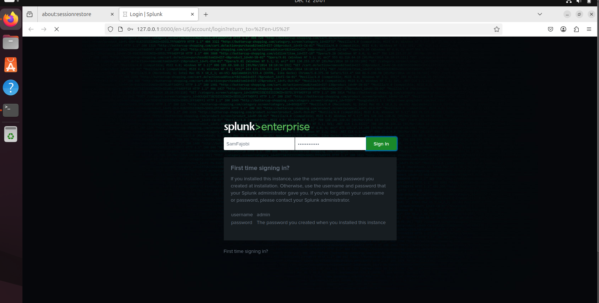
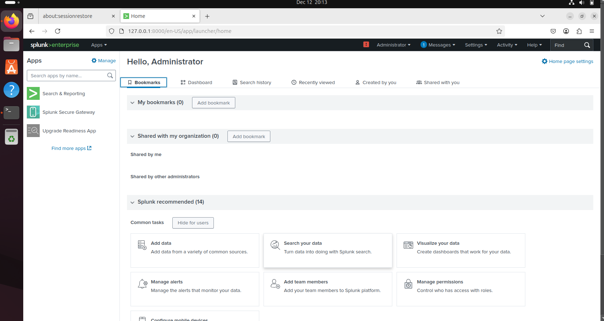

# **Install and Configure Splunk**

---

## **Lab Setup**  
### **Requirements**  
- **System:** Ubuntu >= 22.04 / 20.04 (Server or Desktop)  
- **Tools Required:**  
  - **Splunk Enterprise (Free version for local setup)**  
  - **Terminal (Command Line Access)**  

---

## **Steps to Install and Configure Splunk on Ubuntu**

### **Step 1: Download Splunk**
1. Open **Terminal** and download Splunk using `wget`:

```
wget -O splunk-9.3.0-51ccf43db5bd-linux-2.6-amd64.deb 
"https://download.splunk.com/products/splunk/releases/9.3.0/linux/splunk-9.3.0-51ccf43db5bd-linux-2.6-amd64.deb"
```
    

2. Once downloaded, type ls to view the splunk file, copy the file name and install Splunk:
```
sudo dpkg -i <file>
```

### Step 2: Enable Splunk as a Service
1. Move to the Splunk installation directory:
```
cd /opt/splunk/bin
```
2. Accept the license agreement and enable Splunk at boot:
```
sudo ./splunk enable boot-start --accept-license
```

3. Start Splunk:
```
sudo ./splunk start
```

4. When prompted, set up an admin username and password.

### Step 3: Access Splunk Web Interface
1. Open a web browser and go to:
```
http://<your-server-ip>:8000
```
2. Log in with the admin credentials created earlier.


   

## Conclusion
✅ Successfully installed Splunk on an Ubuntu machine.  
✅ Configured Splunk as a service and enabled auto-start.  
